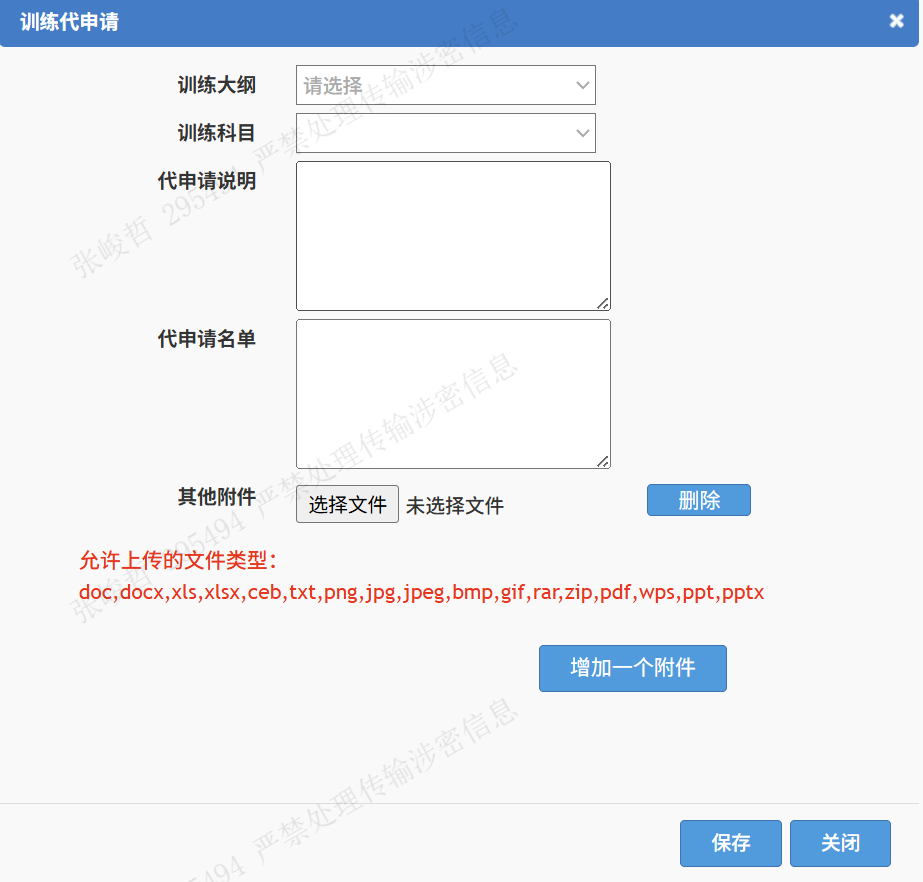
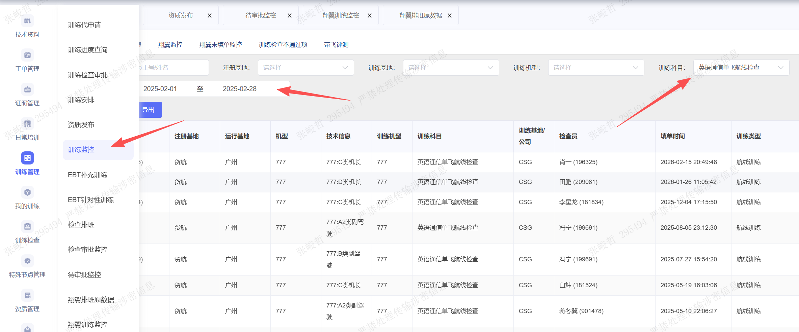

发布资质的全流程是：

1.层级审批（飞行员申请→分部审批→训练室审批→飞行部经理审批→总飞行师审批（如需））

或者训练代申请，可以跳过审批流程

训练待申请中填写申请人员工号。

2.指派检查

3.排班室排班，安排检查

4.检察员填单

5.审批工作单（如果检查通过）

6.发布资质

**常用操作**

在训练监控模块中，通过选择日期和训练科目，可以查询指定时间内通过/不通过的某一指定科目。