## 通讯

十大区域划分：飞机驾驶员的英语通信资格按照十个区域分别进行建立英语通信经历飞行和通信资格检查。十个区域划分为：
| 区域代码 | 区域                             | 资质类型 |
| -------- | -------------------------------- | -------- |
| EAMA     | 北美区域                         | 英语通信 |
| ENEA     | 日韩区域                         | 英语通信 |
| ESEA     | 东南亚及港澳台区域               | 英语通信 |
| EMAR     | 俄罗斯、中亚、蒙古区域           | 英语通信 |
| EWAS     | 西亚和撒哈拉以北的非洲区域       | 英语通信 |
| EAFR     | 撒哈拉以南的非洲区域             | 英语通信 |
| ESAS     | 南亚区域                         | 英语通信 |
| EOCE     | 澳大利亚、新西兰和太平洋岛国区域 | 英语通信 |
| EEUO     | 除俄罗斯外的欧洲区域             | 英语通信 |
| EAMO     | 南美区域                         | 英语通信 |

ICAO 英语等级（4 级或以上）有效期为3年：

如2026.1.1日获取资格，2029年1.1日资格失效

国际资质（单飞、报务）需要在12个日历月内运行，否则资格失效
## 应急

应急有效期：24个日历月，如2026.1.1日完成应急训练，则2028.1.1过期。

应急课程时间：
转机型：6小时

复训：4小时

应急资质失效：应急资质为**必要资质**，不完成不能上飞机。需要完成4小时**复训**后才能运行。

## CRM

CRM每年做。3年覆盖全部主题，下述不适用。

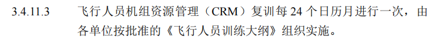

## 定期复训和熟练检查

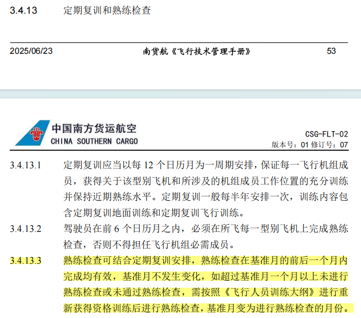

什么时间做实践考试？获取资质或者资质失效时需要申请实践考试，资质保持不需要。

关键：

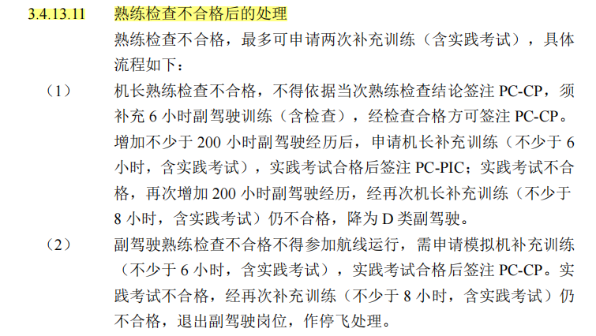
暂停飞行12个日历月后，不再投入训练资源。
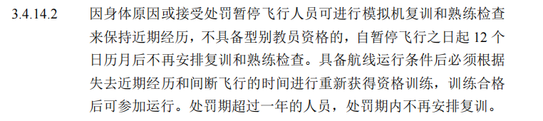

特指恢复资格的航线检查。不是一检二检

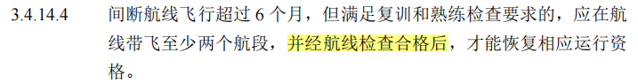

A教做检查评估，BC教做实践考试（来源于局方只分类型别教员）

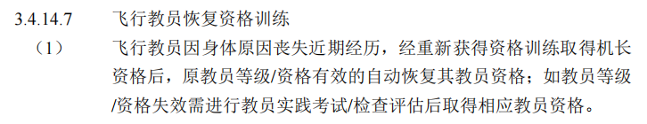

**委托**

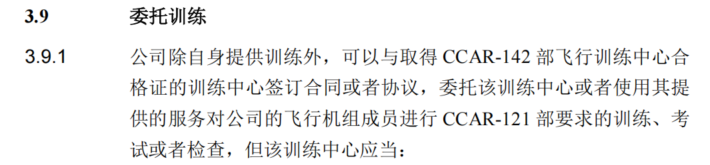

干租：只有模拟机

湿租：模拟机+教员一起

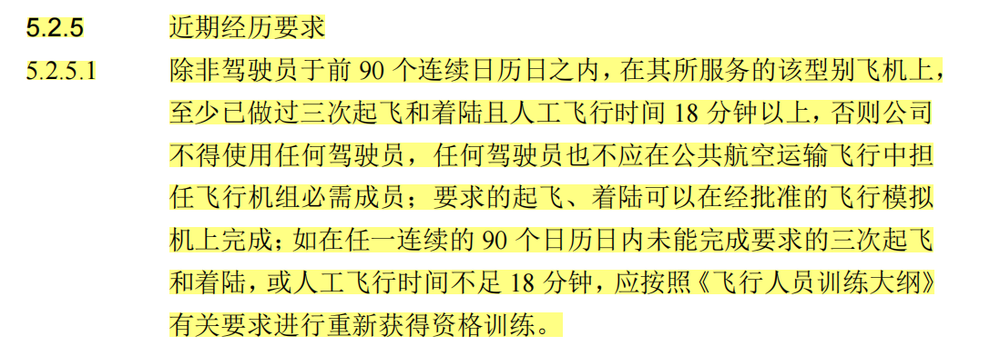

检查类型（航线/模拟机..），课时要求，教员要求

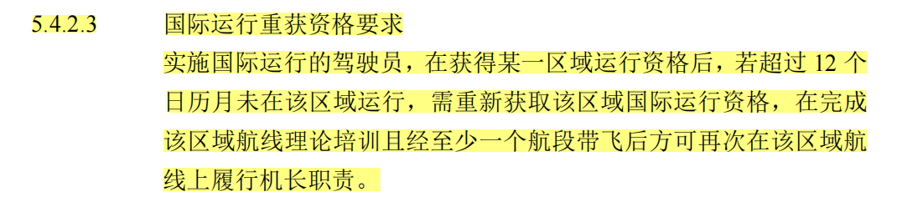

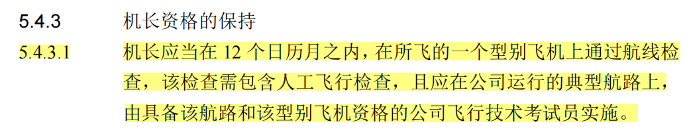

机长年度航线检查1年一次，有基准月概念

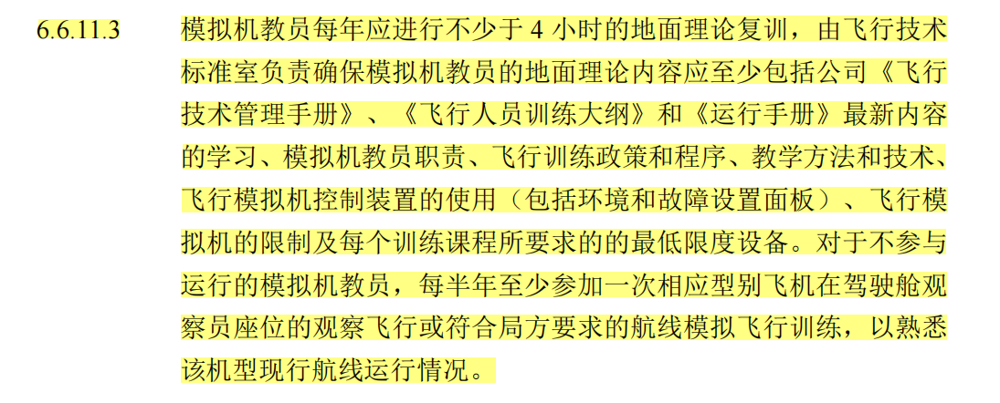
