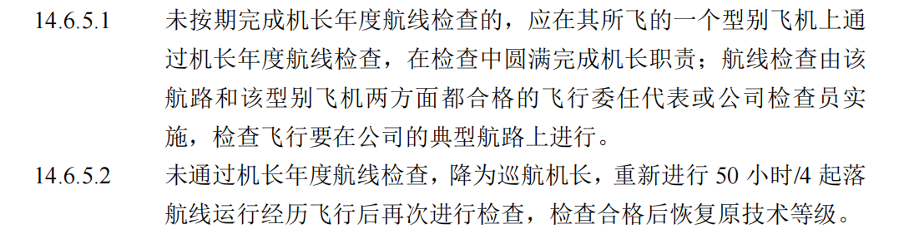
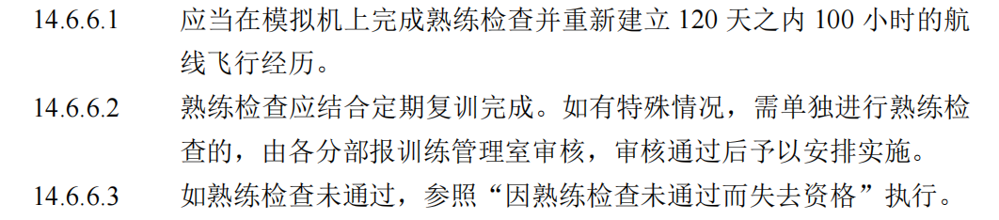

**因不满足近期经历要求失去资格的**
近期经历基准月：最后一次起落时间
课程安排：
在任一连续的 90 个日历日内未能完成要求的三次起飞和着陆的人员，应当按照下列要求重新建立近期经历：
（1） 在飞行检查员监视下，在所飞的该型别飞机上，或者在经批准的飞行模拟机上至少完成三次起飞和着陆；
重新建立近期经历可以结合复训进行

**因未按期完成定期复训、熟练检查而失去资格的**
复训基准月：首次基准月由实践考试所在的月决定，后续由熟练检查月决定
按失去资格的时间不同（见本章进入条件），开展不同要求的地面理论训练、飞行训练器和模拟机训练、本场训练和航线经历飞行。

参考手册原文即可

**因熟练检查未通过而失去资格**
熟练检查不合格的当日立即失去相应资格，当月为失去资格的第1个日历月。熟练检查不合格，机长、副驾驶阶段分别最多可申请两次补充训练（含实践考试）

一、通用规定
熟练检查不合格 → 当日立即失去相应资格
不合格当月 = 失去资格的第1个日历月。
无论机长还是副驾驶：
最多可申请 2 次补充训练（含实践考试）。

二、机长熟练检查不合格

机长熟练检查不合格 → 不得签注 PC‑CP
必须先完成：6 小时副驾驶训练（含检查）
副驾驶训练检查合格
可签注 PC‑CP
需累积 ≥200 小时副驾驶经历
再参加：机长模拟机补充训练 ≥6 小时（含实践考试）
考试合格 → 签注 PC‑PIC
考试不合格 → 再累积 ≥200 小时副驾驶经历
再参加：机长模拟机补充训练 ≥8 小时（含实践考试）
合格 → 签注 PC‑PIC
仍不合格 → 降为 D 类副驾驶，3 年内不得担任机长
再累积 ≥1000 小时副驾驶经历 后，可重新申请升级训练

副驾驶训练检查不合格，不得参加航线运行
第一次不合格 → 再次补充副驾驶训练（含检查）
合格 → 签注 PC‑CP
仍不合格 → 第二次补充副驾驶训练（含检查）
合格 → 签注 PC‑CP
仍不合格 → 退出飞行岗位，停飞

复训与熟练检查安排
取得 PC‑PIC 前，复训 / 熟练检查按 副驾驶 标准安排
若按副驾驶标准仍不合格 → 按副驾驶熟练检查不合格处理

补充训练时长（按失格时间）
失格 ≤3 个日历月 → 补充训练 6 小时
失格 4～6 个日历月 → 补充训练 8 小时
失格 ＞6 个日历月 → 按未按期完成复训 / 熟练检查条款执行

三、副驾驶熟练检查不合格

副驾驶熟练检查不合格 → 不得参加航线运行
需进行：副驾驶模拟机补充训练（含实践考试）
第一次考试合格 → 签注 PC‑CP
第一次不合格 → 再次补充训练 + 考试
合格 → 签注 PC‑CP
仍不合格 → 退出副驾驶岗位，停飞

时限与训练时长
补充训练应在 30 个日历日内完成
超过 30 日的，按失格时间确定训练时长：
失格 ≤3 个月 → 6 小时
失格 4～6 个月 → 8 小时
失格 ＞6 个月 → 按未按期完成复训 / 熟练检查条款执行

熟练检查不合格 → 当日失去资格
机长、副驾最多 2 次补充训练机会
机长不合格：先回副驾补训，再考机长；连续不过 → 降级 / 停飞 / 3 年禁任机长
副驾不合格：2 次补考不过 → 直接停飞
失格越久，补充训练时间越长：≤3 个月 6h，4‑6 个月 8h，超 6 个月从严

**因未按期完成机长年度航线检查或检查不合格而失去资格的**

**因在完成新机型或者新职位上的训练之后的** 120 **天之内没有完成必需的100小时航线飞行经历时间而失去资格的**

